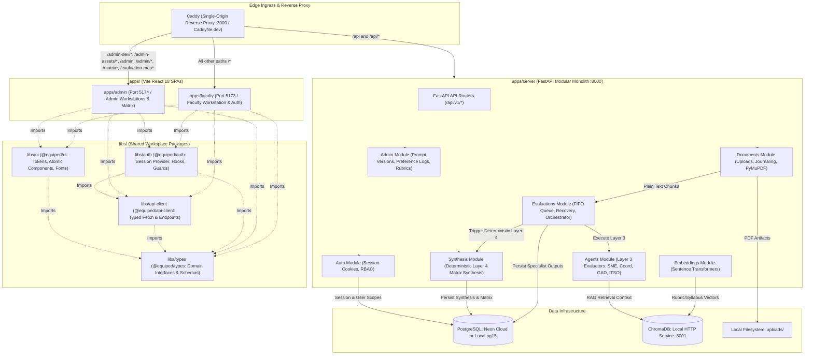

# EquipED Architecture & System Structure

Authoritative architectural specification for the EquipED platform, documenting the verified **current monorepo architecture**, the repository's **code-writing style**, and operational boundaries.

---

## 1. System Purpose & Core Invariants

EquipED evaluates Self-Paced Learning Materials (SLMs) from Laguna State Polytechnic University – Santa Cruz Campus (LSPU SCC), College of Computer Studies (CCS), against institutional rubrics and authoritative reference documents across four independent evaluation perspectives:
1. **SME (Subject Matter Expert)**: Pedagogical coherence, content accuracy, and assessment quality.
2. **Coordinator (Program Coordinator)**: Curriculum alignment and Outcomes-Based Education (OBE) compliance.
3. **GAD (Gender & Development)**: Inclusivity, non-discriminatory language, and gender-responsive representation.
4. **ITSO (Innovation and Technology Support Office)**: Intellectual property, citations, and digital/data privacy compliance.

### Non-Negotiable System Invariants

1. **Human Authority**: Human evaluators and CID QA experts remain authoritative. Agent-generated scores, highlights, and rationales are strictly advisory co-pilot outputs.
2. **Dual-Path Data Processing**:
   - **SLM Modules (Direct Input)**: Faculty-uploaded SLMs are parsed and extracted into chunked text. SLM chunks are fed directly to evaluators as plain text. **SLMs are never embedded or vectorized into ChromaDB.**
   - **Reference Documents & Rubrics (Vector Retrieval)**: Institutional syllabi, curriculum guides, and rubrics are parsed, chunked, and embedded into private vector storage to serve retrieval-augmented generation (RAG).
3. **Local Data Residency & Privacy**: All vector storage, document artifacts, and relational data reside locally or in private infrastructure. No module content or prompt inputs are sent to external third parties without explicit authorization.
4. **Deterministic Synthesis**: Layer 3 specialist evaluations run independently and are persisted to relational storage. Layer 4 is an in-process, deterministic synthesis step that aggregates scores, flags, and cross-domain findings into the terminal monitoring matrix. No further automated layers or open-ended autonomous agents run beyond Layer 4.
5. **Truthful Evaluation States**:
   - Explicit full evaluations require all active specialist agents to succeed.
   - Partial evaluations are permitted solely through deliberate user intent (e.g., acknowledged absent syllabus) and must record explicitly which domains were executed or skipped.
   - Runtime failures must fail closed and never present as partial success.
6. **No External Message Broker**: In-process durable DB-backed FIFO queueing handles asynchronous evaluations without Celery, Redis, or distributed broker infrastructure.

---

## 2. Current Architecture (Implemented Monorepo)

The system operates as a unified **pnpm + uv monorepo** consisting of a single-process FastAPI modular monolith (`apps/server`), two feature-driven React Vite applications (`apps/faculty` and `apps/admin`), extracted shared workspace libraries (`libs/*`), and a reverse-proxy ingress (`infra/caddy/Caddyfile.dev`).



### Current Repository Layout

```text
EquipED/
├── apps/
│   ├── faculty/                # Public & Faculty portal (React 18 + Vite, port 5173)
│   │   ├── src/
│   │   │   ├── features/       # Feature modules: home, documents, evaluation, history,
│   │   │   │                   # curriculum-alignment, syllabus-alignment, auth
│   │   │   └── app/            # Composition root: shell, providers, TanStack router
│   │   └── package.json
│   ├── admin/                  # Institutional Administrator portal (React 18 + Vite, port 5174)
│   │   ├── src/
│   │   │   ├── features/       # Workstations: home, user-management, reference-ingestion,
│   │   │   │                   # reference-library, agent-prompt, preference-log,
│   │   │   │                   # rubric-editor, model-validation, monitoring-matrix,
│   │   │   │                   # evaluation-map
│   │   │   └── app/            # Composition root: shell, providers, TanStack router
│   │   └── package.json
│   └── server/                 # Single-process modular monolith (Python 3.12 + FastAPI, port 8000)
│       ├── core/               # Infrastructure only (DB pools, LLM clients, Chroma adapter, logging)
│       ├── modules/            # Domain modules (documents, evaluations, agents, synthesis, etc.)
│       ├── alembic/            # Database schema migrations
│       ├── scripts/            # Database seeds and benchmark runners
│       ├── tests/              # Backend test suites
│       └── pyproject.toml      # Server dependencies and tool settings
├── libs/
│   ├── auth/                   # Shared session provider (AuthProvider), useAuth hook, RBAC guards,
│   │                           # authApi, BrandHero, and ResetPasswordModal (@equiped/auth)
│   ├── api-client/             # Typed fetch client (requestJson, ApiError, buildApiUrl) and
│   │                           # endpoint modules (@equiped/api-client)
│   ├── types/                  # Leaf TypeScript contracts: documents, evaluations, programs (@equiped/types)
│   └── ui/                     # Design tokens, primitives (Button, Badge, Card, Input, Skeleton,
│                               # TableSkeleton, ProgramSelector, cn), fonts, and styles (@equiped/ui)
├── infra/
│   └── caddy/                  # Caddy reverse proxy ingress configuration (Caddyfile.dev)
├── uploads/                    # Local document file storage (git-ignored, root-anchored)
├── chroma_data/                # Local ChromaDB vector storage (git-ignored, root-anchored)
├── pnpm-workspace.yaml         # pnpm monorepo workspace definition
└── package.json                # Root workspace orchestration scripts
```

### Ingress, Routing & Same-Origin Topology

In development, `apps/faculty` and `apps/admin` function under a single unified origin managed by Caddy. Production must preserve this same-origin contract, but its static-serving and container topology remains deferred:

1. **Caddy Dev Ingress (`infra/caddy/Caddyfile.dev`)**:
   - Single-origin local ingress listening on `:3000` (configurable via `CADDY_DEV_ADDR`).
   - Run via `pnpm dev` (concurrent orchestration) or `pnpm dev:proxy` (standalone proxy).
   - Route precedence rules:
     1. `/api` and `/api/*` → Proxied directly to FastAPI backend `127.0.0.1:8000`. Does not rewrite or strip paths, and does not fall back to SPA index on upstream errors.
     2. `/admin-dev/*`, `/admin-assets/*`, `/admin`, `/admin/*`, `/matrix`, `/matrix/*`, `/evaluation-map`, `/evaluation-map/*` → Proxied to Admin Vite server `127.0.0.1:5174`.
     3. All remaining paths (`/*`) → Proxied to Faculty Vite server `127.0.0.1:5173`.
2. **Vite Namespacing & Assets**:
   - In development, Admin Vite serves with `base: '/admin-dev/'` so Vite's module graph does not collide with Faculty Vite's `/src/*` namespace.
   - Built assets for admin are partitioned under `assetsDir: 'admin-assets'`, ensuring no static asset collisions when proxied.
3. **Internal Vite Dev Proxy (Container-Free / No-Caddy Fallback)**:
   - If Caddy is not installed on the local machine, developers can open Faculty Vite directly at `http://localhost:5173`.
   - `apps/faculty/vite.config.ts` includes fallback proxy rules forwarding `/api` to port 8000 and `/admin-dev`, `/admin-assets`, `/admin`, `/matrix`, `/evaluation-map` to port 5174.
   - Direct access to `http://localhost:5174` serves as an isolated component-debug endpoint only; canonical navigation origin is Caddy (`:3000`) or Faculty proxy (`:5173`).
4. **Shared Session Cookie & Cross-App Navigation**:
   - A single `HttpOnly`, `SameSite=Lax`, `Path=/` session cookie (`equiped_session`) authenticates requests across both frontends and the backend monolith.
   - Cross-application route transitions (e.g. redirecting an admin from `/login` or `/` to `/admin`, or redirecting unauthorized non-admins to `/dashboard`) use standard document navigation (`window.location.assign(...)`) rather than cross-app router imports.
5. **Exact Preserved Routes**:
   - **Faculty Routes** (`apps/faculty/src/app/router.tsx`):
     - Public: `/login`, `/register`
     - Authenticated root: `/` (redirects authenticated faculty to `/dashboard`, authenticated admin to `/admin`, unauthenticated to `/login`)
     - Faculty protected: `/dashboard`, `/documents`, `/documents/$documentId/evaluation` (redirects to assigned specialist scoreboard), `/storage` (redirects to `/documents`), `/specialists/$agentId`, `/specialists/$agentId/$documentId`, `/evaluations`, `/evaluations/$id`, `/syllabus-alignment`, `/syllabus-alignment/$documentId`, `/syllabus-alignment/$documentId/report`, `/alignment`
   - **Admin Routes** (`apps/admin/src/app/router.tsx`):
     - Authenticated root: `/` (redirects admin to `/admin`, non-admin to `/dashboard`, unauthenticated to `/login`)
     - Admin protected: `/admin`, `/admin/users`, `/admin/ingest`, `/admin/references`, `/admin/prompts`, `/admin/prompts/$agentId`, `/admin/preferences`, `/admin/rubrics`, `/admin/model-validation`, `/admin/synthesis/$documentId`, `/matrix`, `/matrix/$documentId`, `/evaluation-map`

### Current Official Local Topology

In local development, the topology operates as follows:
- **Client Applications**: Host-native Vite dev servers running at `127.0.0.1:5173` (`apps/faculty`) and `127.0.0.1:5174` (`apps/admin`), exposed via Caddy at `http://localhost:3000`.
- **Backend Server**: Host-native FastAPI server running at `127.0.0.1:8000`, invoked via `pnpm server:dev` or `cd apps && uv run --project server uvicorn server.main:app --reload --port 8000`. Backend modules use absolute `server.*` imports; running from `apps/` ensures `apps/` is the Python import root.
- **Relational Database**: Shared Neon PostgreSQL instance over TLS (or optional local container on port 5433). Configured via `DATABASE_URL`.
- **Vector Database**: Local Chroma instance running as an HTTP service on port 8001 via Docker Compose (`pnpm infra:chroma` or `docker compose up -d chroma`). Compose persists data in the `chroma_data` volume; host-mode scripts resolve root `chroma_data/`.
- **Document Storage**: Stored on the local host filesystem under repository root `uploads/` directory with transactional crash-journaling.

### Backend Modular Monolith Structure

The backend (`apps/server/`) is structured strictly as an in-process modular monolith:
- `apps/server/core/`: Contains **infrastructure only** (database connection pools, settings, base exceptions, logging setup, LLM provider clients, and Chroma adapters). Core contains **zero business logic**.
- `apps/server/modules/`: Domain packages containing their own routers, service facades, domain models, Pydantic schemas, and local errors:
  - `documents`: SLM and reference PDF ingestion, OCR processing, text chunking, and journaled deletion.
  - `embeddings`: Embedding pipeline and similarity retrieval scoped **exclusively** to syllabi, curricula, and institutional rubrics.
  - `evaluations`: DB-backed FIFO queue, CAS claim token admission, worker drain loop, Layer 3 agent dispatch, and crash recovery.
  - `agents`: Evaluator prompts, LLM client execution, and individual rubric scoring for SME, Program Coordinator, GAD, and ITSO.
  - `synthesis`: Aggregates Layer 3 persisted agent outputs, derives the terminal monitoring matrix, and computes holistic recommendations.
  - `curriculum` & `curriculum_alignment`: Program curriculum structure and degree-level alignment checking.
  - `syllabus_alignment`: Course-level learning outcome alignment and standalone alignment runs.
  - `rubrics`: Rubric domain definitions, criteria trees, and versioned rubric configurations.
  - `feedback`: Preference logging (accept/reject/edit) on agent outputs for administrative review.
  - `admin`: User administration, prompt versioning, reference catalog ingestion, and model calibration history.

### Layer 3 / Layer 4 Execution Lifecycle

Execution follows an active supervisor pattern with terminal synthesis:
1. **Submission & Admission**: An evaluation request creates an `evaluation_jobs` record with status `SUBMITTED`. Evaluation targets may be a full four-agent bundle, a targeted individual agent, or scheduled agents based on permission and intent.
2. **Preprocessing**: Document chunks are loaded and validated. If syllabus context is required but unavailable, user-acknowledged partial evaluation is respected; otherwise the job fails closed.
3. **Layer 3 Specialist Analysis**: The supervisor orchestrates evaluation across the selected domains (SME, Coordinator, GAD, ITSO). Domains run independently and execute in parallel threads.
4. **Output Persistence**: Specialist outputs (criterion scores, justifications, chunk citations, and domain summaries) are persisted into `agent_results` in the relational database.
5. **Layer 4 Deterministic Synthesis**: The orchestrator triggers synthesis. Layer 4 reads the persisted Layer 3 outputs and deterministically computes overall weighted scores, status flags, and the Instructional Materials Monitoring Matrix entry.
6. **Completion**: The evaluation marks status `COMPLETED` (or intentional partial success). No automated evaluation layers run beyond Layer 4.

---

## 3. Architecture Decisions & Status

The monorepo structure, ingress proxying, package boundaries, and operational scripts are fully implemented. Genuinely deferred production, container, database, and advanced observability decisions remain explicitly cataloged:

| Architecture Area | Status | Current Directive / Boundary |
|---|---|---|
| **Monorepo Layout** (`apps/*`, `libs/*`) | **Implemented** | Applications reside in `apps/` (`faculty`, `admin`, `server`); shared TypeScript libraries reside in `libs/` (`types`, `api-client`, `ui`, `auth`). |
| **Development Edge Ingress Proxy** | **Implemented** | Caddy reverse-proxy manages local single-origin routing (`:3000`) across frontends and API monolith using `infra/caddy/Caddyfile.dev`. Vite internal proxy serves as a container-free host fallback. Production must retain the same-origin route contract, but its static-serving topology is deferred. |
| **Modular Monolith Backend** | **Implemented** | Backend relocated to `apps/server/` while preserving `server.*` import namespace with `apps/` as import root. Core contains infrastructure only. |
| **Shared Auth & Session Cookie** | **Implemented** | HttpOnly session cookie (`equiped_session`) shared across same-origin paths (`Path=/`); server-authoritative RBAC. `@equiped/auth` handles session hydration and guards. |
| **Local-vs-Full Container Dev** | **Deferred** | Host-native hybrid dev (local apps/faculty, apps/admin, apps/server + optional Chroma container via `pnpm infra:chroma`) remains current. Full-container local development workflows are deferred. Docker Compose is optional infrastructure only, not the canonical dev workflow. |
| **Production Frontend Packaging** | **Deferred** | Whether production containers package Caddy + apps together or run separate static containers is deferred. Production static serving configuration remains deferred. |
| **Production PostgreSQL Host** | **Deferred** | Choice between self-hosted Postgres, managed cloud instance, or Neon is deferred to production deployment phase. Dev currently uses shared Neon or local Postgres. |
| **Advanced Observability** | **Deferred** | Formal APM, OpenTelemetry, or distributed tracing beyond `/health`, `/ready`, and structured logging is deferred. |

---

## 4. Ownership Boundaries & Dependency Direction

Architectural hygiene is enforced by clear boundaries and strict dependency directions:

```text
apps/faculty  ───►  libs/auth, libs/api-client, libs/types, libs/ui
apps/admin    ───►  libs/auth, libs/api-client, libs/types, libs/ui
libs/ui       ───►  libs/types
libs/auth     ───►  libs/types, libs/api-client
apps/server   ───►  Self-contained modular monolith (Python 3.12)
```

1. **Libraries Must Never Import Applications**: No code under `libs/` may import from `apps/*`.
2. **Library Dependency Hierarchy**:
   - `libs/types` is the bottom dependency; it imports no other workspace package.
   - `libs/ui` depends only on `libs/types` and styling assets. UI never imports `libs/api-client` or business logic.
   - `libs/api-client` depends on `libs/types`.
   - `libs/auth` provides session hooks and guards, depending on `libs/types` and `libs/api-client`.
3. **No Cross-Feature Imports in Frontend Apps**:
   - Inside `apps/*/src/features/`, feature modules (`features/A`) must never import from sibling features (`features/B`).
   - Shared behavior or contracts proven across two or more features must be promoted to `libs/*` (or `src/shared/`).
4. **Backend Module Encapsulation**:
   - `apps/server/core/` is foundational infrastructure. Modules may import `core/`, but `core/` must never import domain modules (`apps/server/modules/*`).
   - Modules communicate through public service facades or explicit data contracts. Never reach into another module's private database models or internals.
   - Routers are thin HTTP adapters. A `service.py` may expose stable imports but contains no business rules; rules belong to cohesive units such as admission, workflow, commands, jobs, or results, while repositories own persistence and queries own reads.

---

## 5. Code Writing Style & Engineering Standards

All contributions must adhere to the practical code writing style grounded in repository configurations (`pyproject.toml`, `eslint.config.js`, `tsconfig.json`).

### 5.1 Python & Backend Standards (Python 3.12)

- **Target & Tooling**: Target Python 3.12+. Use `uv` for environment and package management. Enforce formatting and linting via Ruff (`line-length = 88`, rules: `E`, `F`, `I`, `UP`).
- **Module Architecture**:
  - Keep modules cohesive and focused.
  - Public `service.py` files act as facades for domain capabilities, re-exporting operations while delegating to specialized internal units (`admission.py`, `workflow.py`, `commands.py`, `jobs.py`, `queries.py`, `repository.py`, and `results.py`) where those responsibilities exist.
  - `router.py` files are strictly HTTP transport adapters (validating parameters, unwrapping session identity, handling status codes, returning schemas). No business logic belongs in routers.
- **Typing & Modern Syntax**:
  - Always use `from __future__ import annotations`.
  - Use PEP 604 union syntax (`str | None`, `int | float`) instead of `Optional` or `Union`.
  - Use built-in generic collections (`list[str]`, `dict[str, Any]`, `tuple[int, ...]`) and `collections.abc` (`Iterable`, `Sequence`, `Callable`) instead of typing module equivalents.
- **SQLAlchemy & Thread Safety**:
  - **Never share an ORM `Session` or attached ORM model instances across threads.**
  - Pass precomputed, immutable primitives or frozen dataclasses into worker threads.
  - When worker threads need database access, pass the `session_factory` and allow the worker to open, commit, and cleanly close its own local session.
- **State & Error Semantics**:
  - Error responses must be explicit, typed, and structured. Routers translate established domain exceptions into intentional HTTP status codes without leaking internal failures.
  - Enforce fail-closed document ingestion: corrupted or non-parsable files must fail with clear diagnostics and leave no orphaned DB or disk records.

### 5.2 TypeScript & Frontend Standards (React 18)

- **Target & Tooling**: Use TypeScript 5.5+, React 18, Vite, and Tailwind CSS.
- **Strict Colocation**:
  - Colocate components, hooks, API callers, local types, and tests directly within their owning feature folder:
    ```text
    features/documents/
    ├── api/           # API fetchers & TanStack queries
    ├── components/    # Feature-specific UI components
    ├── hooks/         # Feature-specific hooks
    ├── types/         # Feature-specific TypeScript types
    └── __tests__/     # Feature unit and component tests
    ```
- **Promotion Rule**: Do not place single-use utilities in shared folders. Code only moves to `shared/` or `libs/*` after proven reuse across two or more distinct features.
- **No Cross-Feature Imports**: Enforced strictly. If Feature A requires data or views from Feature B, the dependency must be refactored into a shared library, routed via URL/shell, or orchestrated at the app shell level.
- **Accessibility & Design System (WCAG 2.1 AA)**:
  - Adhere to institutional design tokens from `DESIGN.md` (primary `#1b3b87`, canvas `#f4f7fb`, readable typography).
  - Flat elevation, high-contrast borders (`4.5:1` minimum for body and inputs).
  - Explicit visible focus indicators on all interactive controls.
  - Respect `@media (prefers-reduced-motion: reduce)` by disabling animations and replacing with instant or basic opacity shifts.
  - No external component kits (no `shadcn/ui`, no generic SaaS component templates).

### 5.3 Quality Gates & Minimal Diff Rule

- **Minimal Diff Principle**: When implementing features or fixing defects, craft surgical diffs. Do not perform unrelated refactoring, drive-by reformatting, or blanket styling churn.
- **Evidence Gate**: Every change must be verified using the narrowest affected tests first:
  - Backend tests: `pnpm server:test` or `cd apps && uv run --project server pytest server/tests/<area>`
  - Backend lint: `pnpm server:lint` or `cd apps && uv run --project server ruff check server`
  - Backend format: `pnpm server:format`
  - Frontend/lib tests: `pnpm test` (or `pnpm --dir apps/faculty test`, `pnpm --dir apps/admin test`, `pnpm --dir libs/<name> test`)
  - Workspace typecheck: `pnpm typecheck`
  - Workspace lint: `pnpm lint`
  - Reverse proxy contract: `pnpm test:caddy`
- **Reconciliation Invariant**: If code, migrations, tests, and documentation disagree, never resolve the discrepancy silently. Reconcile explicitly against product truth.
