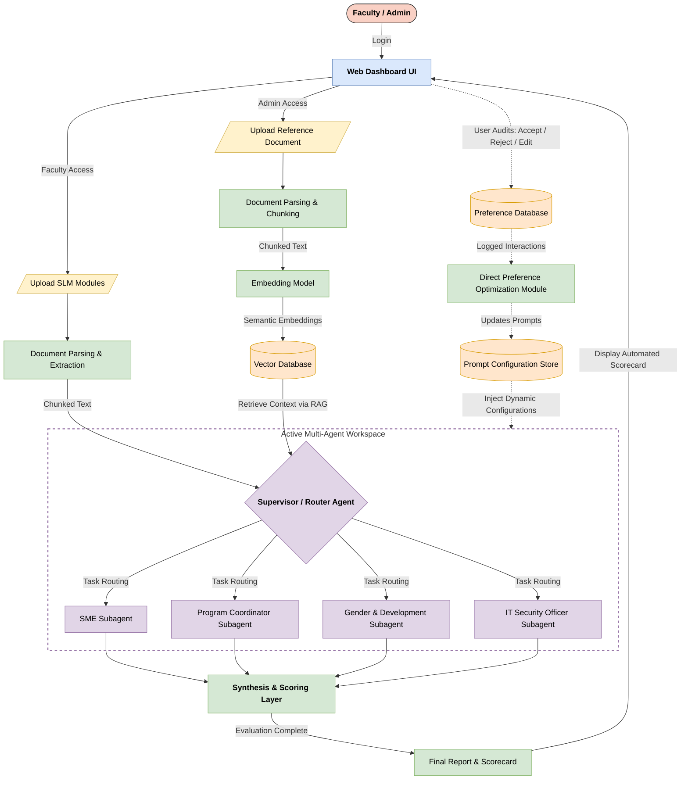

# EquipED Architecture

## System Overview

## Two Independent Paths

### 1) SLM Evaluation Path (Direct Input)

This path is for faculty-uploaded SLM PDFs that feed the Supervisor / Router Agent directly.

- Faculty uploads the SLM PDF.
- The document is parsed and extracted into chunked text.
- SLM chunks are stored as text only.
- No embedding is generated for SLM content.
- During evaluation, SLM chunks are passed directly to the Supervisor / Router Agent as input.

### 2) Reference/Rubric RAG Path (Vector Retrieval)

This path is for reference documents and rubrics uploaded by faculty or admin and routed through embedding plus Vector DB retrieval.

- Faculty/admin uploads syllabus, curriculum, or rubric PDFs.
- The document is parsed, chunked, and embedded.
- Semantic embeddings are stored in the vector database (ChromaDB / Vector DB).
- During evaluation, the Supervisor / Router Agent retrieves relevant context via RAG from the Vector DB.

## Module Responsibilities

- **Documents**: PDF upload, ingestion, chunking, and ownership-scoped document handling.
- **Embeddings**: Embedding pipeline for reference documents and rubrics only.
- **Evaluations**: Evaluation job lifecycle, orchestration, and execution control.
- **Agents**: Supervisor and evaluator roles for Layer 3 multi-agent analysis.
- **Synthesis**: Score aggregation, flags, reports, and monitoring matrix output.
- **Feedback**: Preference logging for later improvement and review.
- **Admin**: Prompt management and preference review workflows.

## Evaluation Lifecycle

The evaluation job follows a fixed lifecycle:

1. **SUBMITTED** — the evaluation request is accepted.
2. **PREPROCESSING** — documents are prepared, chunked, and routed to the correct path.
3. **EVALUATING** — agents run the Layer 3 multi-agent evaluation.
4. **SYNTHESIZING** — agent outputs are consolidated into the final result.
5. **COMPLETED** — the job finishes successfully.

## Layer 3 / Layer 4 Boundary

EquipED currently implements **Layer 3 multi-agent evaluation** only.

- Layer 3 runs the Supervisor plus SME, Coordinator, GAD, and ITSO roles.
- Layer 4 is **not implemented**.
- The system must stop honestly at the Layer 4 boundary instead of implying unsupported capabilities.

## Data Directories

- `uploads/` at the repo root stores uploaded files.
- `chroma_data/` at the repo root stores ChromaDB vector data.

## Key Design Decisions

- SLMs are direct evaluation input and are **not embedded**.
- Reference documents and rubrics are the only content embedded into ChromaDB.
- Documents are scoped per user for ownership and isolation.
- Phase 1 execution remains sequential through `BackgroundTasks`.
- The preferred local model is an open-source LLM, with Gemma preferred.
- Human review remains authoritative; generated evaluation output is advisory.
